# Quiz League
Football is the most popular sport and “the beautiful game” in the world. Whether you are a football expert or someone who merely kicks a ball in the park, nothing is more exciting than a football quiz test. Quiz league is a quiz about football with 3 different difficulty levels. You receive 10 points for each correct answer on each level, and you have 30 seconds to answer a question. There are four possible responses for each question. When the quiz is over, depending on your final score, you receive a variety of trophies. The highest trophy you can win is the World Cup, while the lowest is a Conference League trophy.

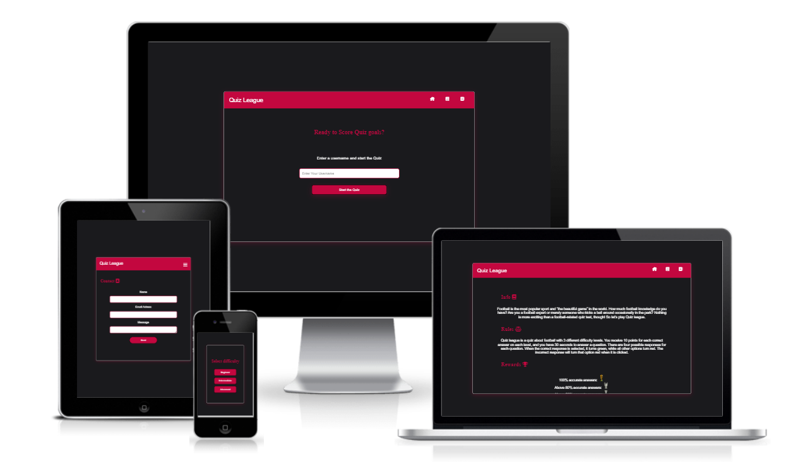
## Features

**Header in the start section:**

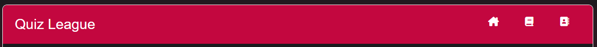
- This section includes the titles of the site, Quiz League, and a responsive navigation bar with a hamburger menu for smaller screens. This header is also present in the contact and info section.

- The nav bar allows users to easily navigate from one section to another and it is responsive for mobile screens with the navigation links turning into a hamburger menu.

**The Landing page:**

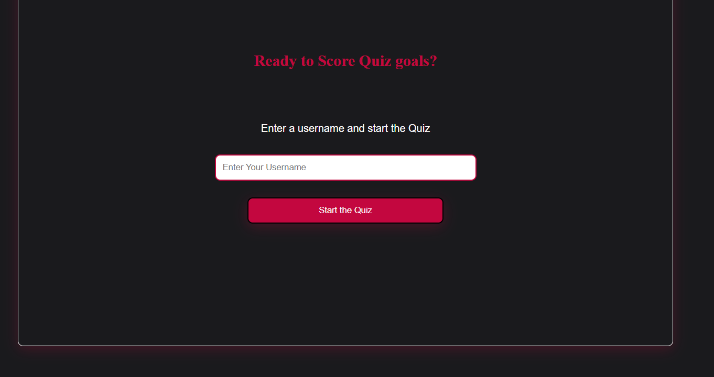
- The landing page includes a header and a form where the user enters a username before starting the quiz.

- The landing page introduces the users to Quiz League while the header on this section encourages viewers to begin the quiz.

**The info section:**

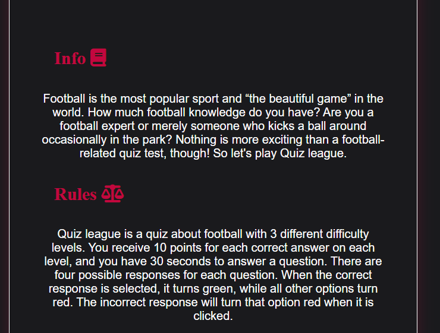
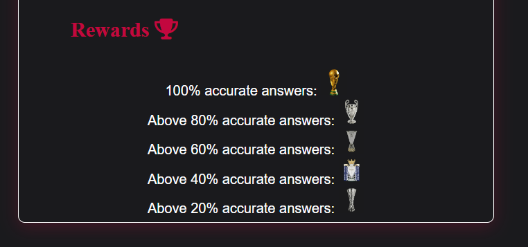
- In this section there is information about the quiz, rules and rewards for different high scores.

- TThis section helps the users to understand what type of question this quiz entails and what the rewards are.

**Contact:**

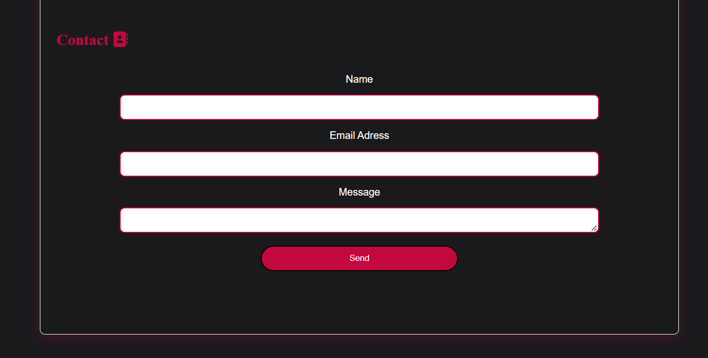
- The contact section consists of a form where the user can write their name, email and a message to send to us.

- The contact section is an important part of the site as the users can send us feedback about the quiz question, answers and more.

**Difficulty level:**

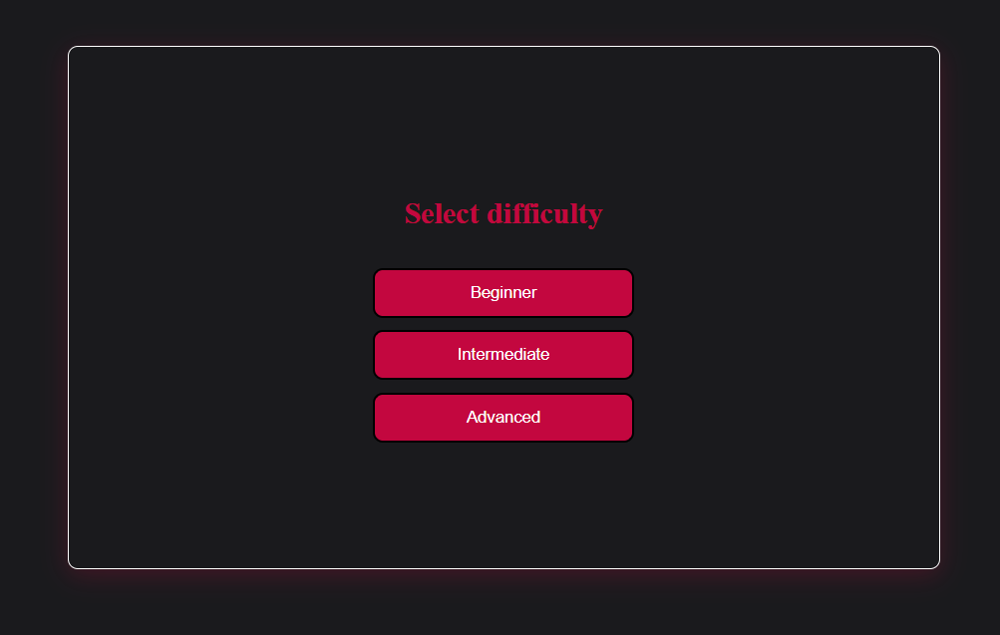
- In this section the user can choose between: beginner, intermediate and advanced difficulty level on the question.

- The difficulty level choice allows the user to test their knowledge on different level of hardship.

**The header in the quiz section:**

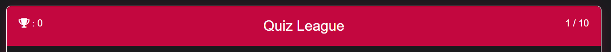
- This header includes the user's score, the site's title and number of  the question the user is currently answering.

- The score will indicate how well the user is performing throughout the quiz and the current question number shows how many questions that are left to answer.

**Question and the answer choices:**

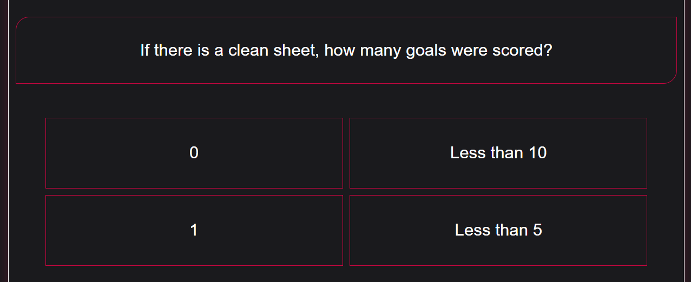
- This is the most important part of the site where the user is presented with a question, based on the difficulty level chosen, and 4 different answer choices where only one answer is right.

- When the correct response is selected, it turns green, while all other options turn red. The incorrect response will turn that option red when it is clicked. 

**The timer and progressbar:**

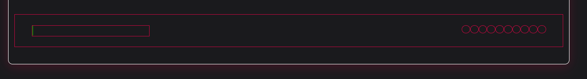
- This section holds the timer for every question, next button to go to the next question and a progress bar. The timer starts every time the user clicks the next button, or starts the game from the beginning, and it stops when the user has clicked on an answer or after 30 seconds.

- When the timer stops the next button shows up for the user to go to the next section. If the user has clicked on the right answer a green football will appear in the progress bar and if the user clicked on the wrong answer or ran out of time a red football will appear in the progress bar.

**The restart section:**

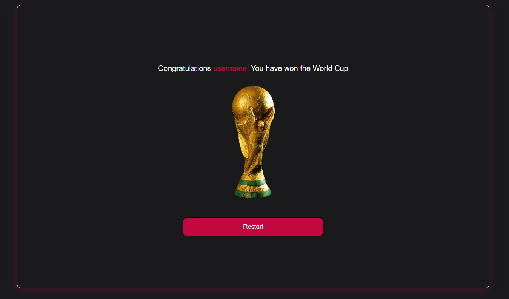
- When the quiz is finished the user will be presented with a congratulations message with their chosen username and a trophy based on their overall score. Furthermore, an option to restart the quiz will also be presented to the user for restarting the quiz if they want

- If you obtain 100% accurate responses, you will be awarded the World Cup trophy.
- If you get more than 80% of them right, you'll win the Champions League trophy.
- If you get more than 60% of them right, you'll win the Europa League - trophy.
- If you get more than 40% of them right, you'll win the Premier League trophy.
- If you get more than 20% of them right, you'll get the Conference League trophy.
- You will not receive any trophies if your correct answers are less than 20%.
- You will also get a commiseration message with your chosen username if your correct answers are less than 20%.

## Validator Testing

- HTML
    * Validated using [W3C](https://validator.w3.org/) HTML validator and no errors were found.

- CSS
    * Validated using [Jigsaw](https://jigsaw.w3.org/css-validator/) validator and no error were found.

- JavaScript
    * The javascript file was tested with the [JSHint ](https://jshint.com/) validator returning no errors.

- I have also checked and tested the site on different browsers such as Chrome, Firefox, Edge and Safari. By using the chrome dev tools and [Am I Responsive?](https://ui.dev/amiresponsive?url=https://8000-jalalk1244-educationfor-fd3e2i2syhp.ws-eu62.gitpod.io/index.html) website have i also checked and confirmed the responsiveness of the site.

- I have tested the links that has an href other than "#" and all of them work.

- Lighthouse report (Chrome dev-tool)
    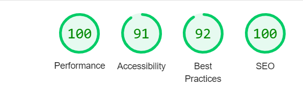

## Deployment

- I deployed my site on git-hub pages by:
    * first opening my site's repository
    * then I clicked on settings
    * after that in the side bar I clicked on "pages"
    * I selceted "deploy from a branch"
    * I selected the main branch
    * lastly I clicked on save.

- The live link: https://jalalk1244.github.io/quiz-league/
     

## Credit

- **Content**

    * The questions in the quiz was taken from:  about Somalia in the project page is taken from [The League Paper](https://www.theleaguepaper.com/guest-blogs/373718/best-50-football-quiz-questions-trivia-and-answers/)
    
    * The icons used in the nav links, in the progress bar and for the score were taken from [Fontawesome](https://fontawesome.com/)

    * The fonts used in this site was taken from [google fonts](https://fonts.google.com/) 

    * The fav icons in window tab was taken from [MomentPath](https://www.momentpath.com/blog/owners-directors-inspiration-inspirational-quotes-about-teaching-children)

- **Media**
    
    * links to the photos:
        - [World Cup trophy](https://thumbs.dreamstime.com/b/fifa-world-cup-thropy-reproduction-original-soccer-isolated-white-gold-trophy-awarded-to-winners-41868445.jpg)
        - [Champions League trophy](https://amballcom.de/product/uefa-champions-league-trophy-45mm/ )
        - [Europa League trophy](https://amballcom.de/product/uefa-europa-league-trophy-100-mm/)
        - [Premier League trophy](https://redditchstandard.co.uk/wp-content/uploads/2018/05/trophy.jpg )
        - [Conference League trophy](https://amballcom.de/product/uefa-europa-conference-league-trophy-100-mm/)
        - [removebg](https://www.remove.bg/t/change-background) was used to change the background of the images.